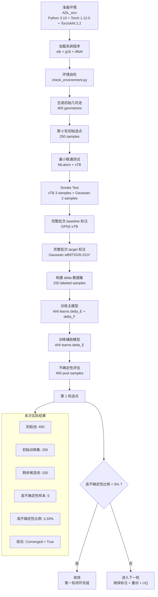
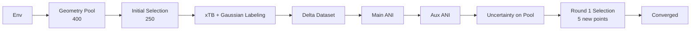

# AIQM 第一轮流程图

这份图示基于本次已经实际跑通的最小版第一轮流程整理，适合：

- 发给老师或同学说明整体执行路径
- 放进实验记录或周报
- 作为后续用 Sora / PPT / Mermaid 继续美化的底稿

## Mermaid 流程图



## 简版展示图



## 本次跑通的关键数字

- 初始几何池：`400`
- 第 0 轮初始样本：`250`
- 成功构建 delta 数据集：`250`
- 不确定性评估样本数：`400`
- 剩余候选池样本数：`150`
- 高不确定性样本数：`5`
- 高不确定性比例：`3.33%`
- 收敛结果：`True`

## Sora 提示词

下面这段可以直接作为 Sora 的中文提示词底稿，再按你自己的审美细化：

```text
请制作一张简洁、专业、适合科研汇报的流程图海报，主题是“AIQM 集群上的主动学习第一轮闭环”。整体风格为现代科研信息图，白底或浅灰底，蓝绿色为主色，强调清晰、理性、计算化学与机器学习结合的气质。

画面采用纵向流程图结构，从上到下展示：

1. 环境准备
   文本：ADL_env, Python 3.10, PyTorch 1.12.0, TorchANI 2.2

2. 系统程序加载
   文本：xTB, Gaussian16, dftd4

3. 环境检查
   文本：check_environment.py

4. 初始几何池生成
   文本：400 geometries

5. 第0轮初始选点
   文本：250 samples

6. 小样本联通测试
   文本：MLatom + xTB, Smoke Test

7. baseline 标注
   文本：GFN2-xTB

8. target 标注
   文本：Gaussian wB97XD/6-31G*

9. 构建 delta 数据集
   文本：250 labeled samples

10. 主模型训练
    文本：ANI learns delta_E + delta_F

11. 辅助模型训练
    文本：ANI learns delta_E

12. 不确定性评估
    文本：400 pool samples

13. 第1轮选点
    文本：5 uncertain samples

14. 收敛判断
    文本：uncertain ratio = 3.33%, converged = true

在右侧增加一个“Result Summary”信息框，显示：
- pool size = 400
- initial training size = 250
- new samples in round 1 = 5
- uncertainty threshold = 0.00869
- converged = true

视觉元素中加入轻量的分子结构线框、GPU 节点、数据集、神经网络、Gaussian 与 xTB 的抽象图标，但不要卡通化。整体排版规整，适合直接插入学术汇报 PPT。
```

## 使用建议

- 如果你是发给老师：优先用上面的“简版展示图”
- 如果你是写实验记录：优先用“Mermaid 流程图”
- 如果你是做 PPT 封面或海报：优先用 “Sora 提示词”
