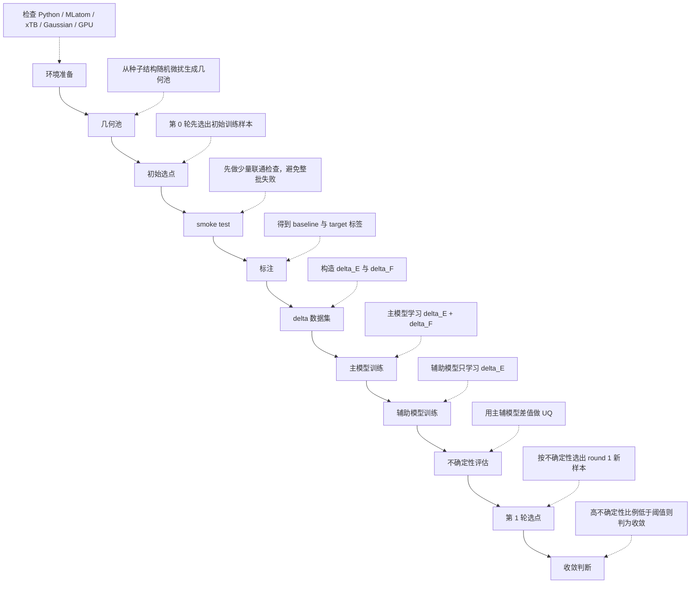

# 流程介绍

这份文档面向第一次接触这个仓库的同学，默认你不是计算化学背景，也不是机器学习背景。目标不是把所有术语一次讲完，而是让你先建立一张清晰的“全局地图”：

- 这个项目在做什么
- 每一步为什么存在
- 关键文件分别负责什么
- 公式到底在说什么
- 跑完以后应该看哪些结果

本文只覆盖当前推荐主线 `minimal_adl_ethene_butadiene/`，不展开仓库中的历史目录 `adl/` 和 `static/`。

## 1. 项目在做什么
如果只用一句日常语言解释，这个项目要做的是：

我们想得到一个“算得快，但尽量接近高精度量化结果”的机器学习势能模型。

这里会反复出现四个关键词：

- `baseline`
  指便宜、快速、能大规模跑的参考方法。这里是 `GFN2-xTB`。它的优点是快，缺点是精度不如更高级的量化方法。
- `target`
  指我们真正希望接近的高精度标签。这里是 Gaussian 的 `wB97X-D/6-31G*`。它更准，但也更慢、更贵。
- `delta-learning`
  不让模型直接去学高精度绝对值，而是只学“高精度结果比低精度结果多出来多少修正量”。
- `active learning`
  不是把几何池里所有样本都做高成本标注，而是先训练一个初版模型，再用不确定性去挑“最值得补标”的样本。

把它们连成一句更完整的话，就是：

先让 `xTB` 给所有几何提供 baseline，再用较少的 Gaussian 标签构造 `delta` 数据集，训练主模型和辅助模型，用两者预测差异估计不确定性，然后只把最不确定的样本送进下一轮标注。

## 2. 总流程图



在当前升级后的主线里，这个流程可以直接由：

- `minimal_adl_ethene_butadiene/scripts/run_first_round_pipeline.py`

一键编排完成。

## 3. 每一步的输入、输出、目的

| 阶段 | 输入 | 做了什么 | 输出 | 目的 |
| --- | --- | --- | --- | --- |
| 环境准备 | `configs/base.yaml`、服务器环境、`ADL_env` | 检查 Python 包、xTB、Gaussian、GPU 和 MLatom 联通情况 | `results/check_environment_latest.json` | 先确认后面不会因环境问题整批失败 |
| 几何池 | `geometries/seed/da_eqmol_seed.xyz` | 对种子结构做随机微扰，生成候选几何池 | `data/raw/geometries/`、`data/raw/geometry_pool_manifest.json` | 准备主动学习的候选池 |
| 初始选点 | 几何池 manifest | 第 0 轮先从池中挑出初始训练样本 | `data/raw/initial_selection_manifest.json` | 给第一轮训练准备起始数据 |
| smoke test | 少量已选样本和当前环境 | 先做少量 `xTB` / Gaussian 联通检查 | 少量 `label.json`、`status.json` 和日志 | 避免直接提交完整批次才发现路径或 PBS 有问题 |
| 标注 | 初始样本 manifest、baseline/target 配置 | 分别计算 `GFN2-xTB` 与 `wB97X-D/6-31G*` 的能量和力 | `labels/xtb/<sample_id>/label.json`、`labels/gaussian/<sample_id>/label.json` | 得到构造 delta 数据集所需的两套标签 |
| delta 数据集 | 几何文件、baseline 标签、target 标签 | 对齐样本并计算能量差和力差 | `data/processed/delta_dataset.npz`、`data/processed/delta_dataset_metadata.json` | 给训练阶段提供统一输入 |
| 主模型训练 | delta 数据集 | 学习 `delta_E + delta_F` | `models/delta_main_model.pt` 及训练摘要 | 建立主预测模型 |
| 辅助模型训练 | delta 数据集 | 只学习 `delta_E` | `models/delta_aux_model.pt` 及训练摘要 | 形成第二个视角，用于 UQ |
| 训练诊断导出 | 训练状态与模型文件 | 统一导出 split、逐样本预测、history 与诊断摘要 | `models/training_split.json`、`models/train_main_predictions.csv`、`models/train_main_history.json` 等 | 让 notebook 不再缺分析输入 |
| 不确定性评估 | 主/辅模型、完整几何池 | 对池中样本做预测并计算 UQ | `results/uncertainty_latest.json` | 找出模型最没把握的样本 |
| 第 1 轮选点 | UQ 结果、已标注样本列表 | 过滤已标注样本并按 UQ 从高到低选点 | `results/round_001_selection_summary.json`、`results/round_001_selected_manifest.json` | 为下一轮补标做准备 |
| 收敛判断 | 第 1 轮选点统计 | 计算高不确定性样本比例 | `converged = true/false` | 决定是否继续下一轮主动学习 |

## 4. 核心文件说明表
下面只覆盖 `minimal_adl_ethene_butadiene/` 的核心文件，按模块分组说明。

### 4.1 配置与输入

| 文件 | 用途 |
| --- | --- |
| `minimal_adl_ethene_butadiene/configs/base.yaml` | 整个项目的总配置入口，定义路径、采样数、训练参数、主动学习阈值、PBS 资源和环境块。当前默认 PBS 训练环境名是 `ADL_env`。 |
| `minimal_adl_ethene_butadiene/geometries/seed/da_eqmol_seed.xyz` | 种子几何，几何池就是在它的基础上做随机微扰得到的。 |

### 4.2 流程脚本

| 文件 | 用途 |
| --- | --- |
| `minimal_adl_ethene_butadiene/scripts/sample_initial_geometries.py` | 从种子结构生成几何池，并写出 pool manifest。 |
| `minimal_adl_ethene_butadiene/scripts/active_learning_loop.py` | 负责初始选点，以及根据 UQ 结果选择下一轮样本。 |
| `minimal_adl_ethene_butadiene/scripts/run_xtb_labels.py` | 批量提交 baseline `xTB` 标注任务。 |
| `minimal_adl_ethene_butadiene/scripts/run_target_labels.py` | 批量提交 target Gaussian 标注任务。 |
| `minimal_adl_ethene_butadiene/scripts/build_delta_dataset.py` | 汇总 baseline 和 target 结果，构建 `delta_dataset.npz`。 |
| `minimal_adl_ethene_butadiene/scripts/train_main_model.py` | 训练主模型，学习 `delta_E + delta_F`。 |
| `minimal_adl_ethene_butadiene/scripts/train_aux_model.py` | 训练辅助模型，只学习 `delta_E`。 |
| `minimal_adl_ethene_butadiene/scripts/evaluate_uncertainty.py` | 用主模型和辅助模型对几何池做预测，输出 UQ 结果。 |
| `minimal_adl_ethene_butadiene/scripts/check_environment.py` | 检查依赖、命令、GPU、MLatom-xTB 联通情况，是开跑前最重要的自检脚本。 |

### 4.3 新增的主控与分析脚本

| 文件 | 用途 |
| --- | --- |
| `minimal_adl_ethene_butadiene/scripts/run_first_round_pipeline.py` | 一键编排第一轮主线，支持 `resume`、`--from-stage`、`--to-stage` 和 `--force`。 |
| `minimal_adl_ethene_butadiene/scripts/export_training_diagnostics.py` | 把 split、predictions、history 和训练诊断信息整理成 notebook 默认可读的标准文件。 |

### 4.4 核心模块

| 文件 | 用途 |
| --- | --- |
| `minimal_adl_ethene_butadiene/src/minimal_adl/geometry.py` | 读写几何文件、生成随机微扰几何、维护 manifest。 |
| `minimal_adl_ethene_butadiene/src/minimal_adl/dataset.py` | 读取标注结果，构建和加载 `delta` 数据集。 |
| `minimal_adl_ethene_butadiene/src/minimal_adl/label_jobs.py` | 组织批量标注任务，支持本地运行、PBS 单样本提交和 worker 模式。 |
| `minimal_adl_ethene_butadiene/src/minimal_adl/mlatom_bridge.py` | 把项目逻辑接到 MLatom，负责方法创建、标注、数据集转成 MLatom 数据库。 |
| `minimal_adl_ethene_butadiene/src/minimal_adl/training.py` | 创建主/辅模型 bundle，训练模型，读取训练状态。 |
| `minimal_adl_ethene_butadiene/src/minimal_adl/delta_model.py` | 定义主模型和辅助模型的最小封装，负责训练、预测、指标汇总和分析产物导出。 |
| `minimal_adl_ethene_butadiene/src/minimal_adl/uncertainty.py` | 计算每个样本的 UQ，并根据阈值生成下一轮选点结果。 |
| `minimal_adl_ethene_butadiene/src/minimal_adl/pbs.py` | 生成 PBS 脚本、提交作业、等待状态文件。 |
| `minimal_adl_ethene_butadiene/src/minimal_adl/config.py` | 加载 YAML 配置，并把相对路径解析成绝对路径。 |
| `minimal_adl_ethene_butadiene/src/minimal_adl/io_utils.py` | JSON、CSV 和文本读写、目录创建、时间戳等通用工具。 |

### 4.5 辅助脚本

| 文件 | 用途 |
| --- | --- |
| `minimal_adl_ethene_butadiene/scripts/execute_label_job.py` | 真正执行单个样本的 baseline 或 target 标注任务。 |
| `minimal_adl_ethene_butadiene/scripts/execute_label_batch.py` | 在一个 PBS worker 作业里并行执行一批标注任务。 |
| `minimal_adl_ethene_butadiene/scripts/optimize_ts.py` | 可选工具，用 MLatom 配合 `xTB` 或 Gaussian 做 TS 优化，不属于第一轮主线。 |

## 5. 核心原理与公式

### 5.1 几何采样
几何池不是凭空来的，而是在种子结构附近做小幅随机扰动：

\[
R_{new} = R_{seed} + \operatorname{clip}(\epsilon, -d_{max}, d_{max})
\]

直观理解是：围着一个已知合理结构，轻微推一推、拉一拉，得到一批相似但不完全相同的几何。

- `R_seed` 是种子几何坐标
- `\epsilon` 是随机扰动
- `clip` 把过大的位移截断到允许范围内
- `d_max` 是最大允许位移

这一阶段的意义是：既保留多样性，又避免样本一上来就偏到特别不合理的结构。

### 5.2 delta 学习
项目不让模型直接学高精度绝对值，而是只学修正量：

\[
\Delta E = E_{target} - E_{baseline}
\]

\[
\Delta F = F_{target} - F_{baseline}
\]

通俗地说：

- `baseline` 已经给出一个“差不多的答案”
- 模型只需要学“还差多少修正量”
- 这样通常比直接学 `target` 更省数据，也更容易收敛

### 5.3 主模型和辅助模型分别学什么
主模型学习：

\[
\text{main model}: (\Delta E, \Delta F)
\]

也就是同时学习能量差和力差。

辅助模型学习：

\[
\text{aux model}: \Delta E
\]

它只学习能量差，主要作用不是替代主模型，而是和主模型形成两个不同视角，用来估计不确定性。

### 5.4 不确定性
当前最小版流程采用非常直观的定义：

\[
UQ = \left| pred\_main\_{\Delta E} - pred\_aux\_{\Delta E} \right|
\]

如果两个模型对同一样本的 `delta_E` 预测差得很大，通常说明这个样本处在模型还不熟悉的区域，因此值得优先补标。

### 5.5 收敛判据
第 1 轮后，会统计高不确定性样本比例：

\[
uncertain\_ratio = \frac{num\_uncertain\_samples}{num\_pool\_samples}
\]

如果这个比例已经很低，说明几何池中大多数样本模型都已经比较有把握。当前默认收敛阈值是 `5%`。

### 5.6 RMSE 和 PCC 的意义
常见指标有 `RMSE` 和 `PCC`。

均方根误差：

\[
RMSE = \sqrt{\frac{1}{N}\sum_{i=1}^{N}(y_i - \hat{y}_i)^2}
\]

它衡量预测值与真实值平均差多少，越小越好。

皮尔逊相关系数：

\[
PCC = \frac{\operatorname{cov}(y, \hat{y})}{\sigma_y \sigma_{\hat{y}}}
\]

它衡量预测趋势与真实趋势是否一致，越接近 `1` 越好。

## 6. 如何判断训练结果好坏
可以先抓住这些最重要的原则：

- `energy RMSE` 越小越好
- `gradient RMSE` 越小越好
- `PCC` 越接近 `1` 越好
- 验证集比训练集更重要
- 训练成功不等于主动学习收敛

也就是说，至少要分成两层看：

- 第一层：模型有没有学到东西
- 第二层：模型学到的东西够不够支持这一轮主动学习结束

## 7. 如何判断这次第一轮为什么算“跑通”
当前这次真实结果摘要是：

- `pool = 400`
- `initial = 250`
- `uncertainty on 400 samples`
- `round 1 selected = 5`
- `uncertain ratio = 3.33%`
- `converged = true`

把这些数字翻译成更容易理解的话，就是：

- 一开始共准备了 400 个候选几何
- 第 0 轮先用 250 个样本构造了第一版训练数据
- 训练完成后，对 400 个池中样本都做了 UQ 评估
- 最终只有 5 个样本高于阈值，值得优先进入下一轮
- 高不确定性比例是 `3.33%`，低于默认的 `5%`
- 因此当前第一轮已经满足最小闭环跑通并达到当前收敛条件

## 8. 现在推荐怎么执行
升级后的推荐命令是：

```bash
cd /share/home/Chenlehui/work/test_ADL/minimal_adl_ethene_butadiene
conda activate ADL_env
python scripts/run_first_round_pipeline.py       --config configs/base.yaml       --submit-mode-labels pbs       --submit-mode-train pbs       --submit-mode-uq pbs
```

跑完以后直接打开：

- `docs/数据分析.ipynb`

标准路径下优先读取：

- `models/train_main_predictions.csv`
- `models/train_main_history.json`
- `models/training_diagnostics.json`
- `results/uncertainty_latest.json`
- `results/round_001_selection_summary.json`
- `results/pipeline_run_summary.json`

## 9. 建议怎么继续读
如果你是第一次接触这个项目，推荐顺序是：

1. 先读 `minimal_adl_ethene_butadiene/README.md`
2. 再读这份 `流程介绍.md`
3. 最后打开 `docs/数据分析.ipynb`
