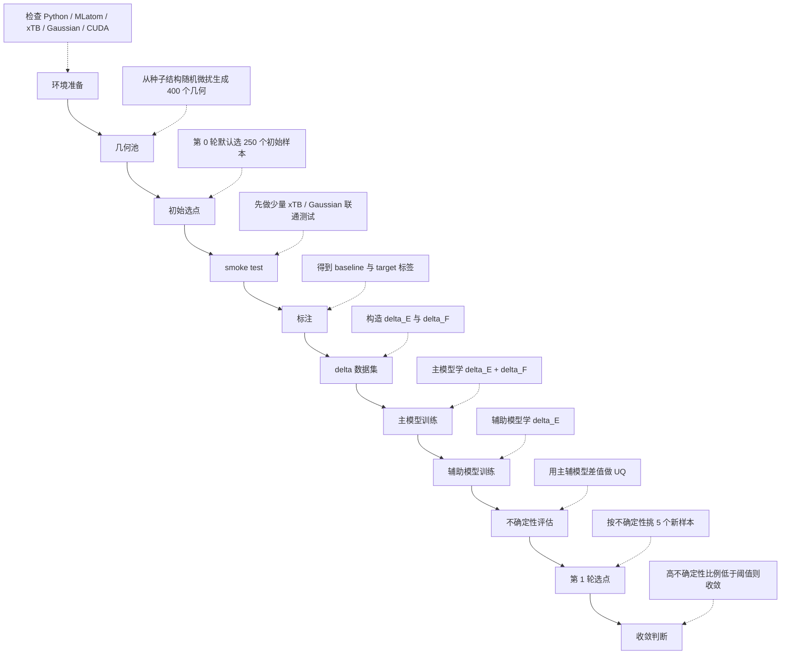

# 流程介绍

这份文档面向第一次接触这个仓库的同学，默认你不是计算化学或机器学习背景。目标不是把所有术语一次讲完，而是帮你先建立一个清楚的整体图景：这套最小版 ADL 第一轮流程在做什么、每一步为什么存在、关键文件在哪里、结果该怎么看。

本文只覆盖当前推荐主线 `minimal_adl_ethene_butadiene/`，不展开仓库中的历史目录 `adl/` 和 `static/`。

## 1. 项目在做什么

这个项目要解决的问题，可以先用一句很日常的话来理解：

我们想得到一个“算得快、又尽量接近高精度量化结果”的势能模型，用它以后更高效地预测分子的能量和力。

这里会反复出现四个关键词：

- `baseline`
  指便宜、快速、能大规模跑的参考方法。这里是 `GFN2-xTB`。它的优点是快，缺点是精度不如更高等级的量化方法。
- `target`
  指我们真正希望接近的高精度标签。这里是 Gaussian 的 `wB97X-D/6-31G*`。它更准，但更慢、更贵。
- `delta-learning`
  不让模型直接从头学 `target`，而是只学“高精度结果比低精度结果多出来多少”。
  也就是学差值，而不是学全部。
- `active learning`
  不是把几何池里所有样本都拿去做高成本标注，而是先训练一个初版模型，再用不确定性找到“最值得补标”的那些点，优先把预算花在刀刃上。

如果把它翻译成一句更完整的话，就是：

先用 `xTB` 给所有几何提供一个便宜的 baseline，再用少量 Gaussian 标签构造 `delta` 数据集，训练主模型和辅助模型，用它们之间的预测差异估计不确定性，然后只挑最不确定的样本进入下一轮标注。

## 2. 总流程图

## 3. 每一步的输入、输出、目的

| 阶段 | 输入 | 做了什么 | 输出 | 目的 |
| --- | --- | --- | --- | --- |
| 环境准备 | `configs/base.yaml`、集群环境、`ADL_env` | 检查 Python 包、`xTB`、Gaussian、GPU 是否可用 | 环境检查结果、可运行环境 | 先确认后面不会因为环境问题整批失败 |
| 几何池 | `geometries/seed/da_eqmol_seed.xyz` | 对种子结构做随机微扰，生成候选几何 | `data/raw/geometries/`、`data/raw/geometry_pool_manifest.json` | 准备主动学习的候选池 |
| 初始选点 | 几何池 manifest | 第 0 轮先从池里挑一批初始样本 | `data/raw/initial_selection_manifest.json` | 给第一轮训练准备起始数据 |
| smoke test | 少量已选样本、当前环境 | 先跑少量 `xTB` 和 Gaussian，检查接口、PBS、路径、日志是否正常 | 少量 `label.json`、`status.json`、日志 | 先确认流程真的能通，再提交完整批次 |
| 标注 | 初始样本 manifest、`baseline`/`target` 方法配置 | 分别计算 `GFN2-xTB` 和 `wB97X-D/6-31G*` 的能量与力 | `labels/xtb/<sample_id>/label.json`、`labels/gaussian/<sample_id>/label.json` | 得到构造 delta 数据集所需的两套标签 |
| delta 数据集 | 几何文件、baseline 标签、target 标签 | 逐样本对齐，计算能量差和力差，写成统一数据集 | `data/processed/delta_dataset.npz`、`data/processed/delta_dataset_metadata.json` | 给后续模型训练提供统一输入 |
| 主模型训练 | delta 数据集 | 训练主模型，学习 `delta_E + delta_F` | `models/delta_main_model.pt`、`models/train_main_status.json`、`models/training_summary.json` | 让模型同时学到能量修正和力修正 |
| 辅助模型训练 | delta 数据集 | 训练辅助模型，只学习 `delta_E` | `models/delta_aux_model.pt`、`models/train_aux_status.json` | 提供第二个视角，给不确定性估计使用 |
| 不确定性评估 | 主模型、辅助模型、完整几何池 | 对池中样本做预测，计算主辅模型差值 | `results/uncertainty_latest.json` | 找到模型最没把握的样本 |
| 第 1 轮选点 | 不确定性结果、已标注样本列表 | 过滤已标注样本，按 UQ 从高到低挑新样本 | `results/round_001_selection_summary.json`、`results/round_001_selected_manifest.json` | 为下一轮补标注准备候选列表 |
| 收敛判断 | 第 1 轮选点统计 | 计算高不确定性样本比例，与阈值比较 | `converged = true/false` | 决定是否继续下一轮主动学习 |

## 4. 核心文件说明表

下面只覆盖 `minimal_adl_ethene_butadiene/` 的核心文件，按模块分组说明。

### 4.1 配置与输入

| 文件 | 用途 |
| --- | --- |
| `minimal_adl_ethene_butadiene/configs/base.yaml` | 整个项目的总配置入口，定义路径、采样数量、训练参数、主动学习阈值、PBS 资源与环境块。 |
| `minimal_adl_ethene_butadiene/geometries/seed/da_eqmol_seed.xyz` | 种子几何，几何池就是在它的基础上做随机微扰生成出来的。 |

### 4.2 流程脚本

| 文件 | 用途 |
| --- | --- |
| `minimal_adl_ethene_butadiene/scripts/sample_initial_geometries.py` | 从种子结构出发生成几何池，并写出几何池 manifest。 |
| `minimal_adl_ethene_butadiene/scripts/active_learning_loop.py` | 负责初始选点，以及后续根据 UQ 结果选下一轮样本。 |
| `minimal_adl_ethene_butadiene/scripts/run_xtb_labels.py` | 批量提交 baseline `xTB` 标注任务。 |
| `minimal_adl_ethene_butadiene/scripts/run_target_labels.py` | 批量提交 target Gaussian 标注任务。 |
| `minimal_adl_ethene_butadiene/scripts/build_delta_dataset.py` | 把 baseline 和 target 的结果配对，写成 `delta_dataset.npz` 与 metadata。 |
| `minimal_adl_ethene_butadiene/scripts/train_main_model.py` | 训练主模型，学习 `delta_E + delta_F`。 |
| `minimal_adl_ethene_butadiene/scripts/train_aux_model.py` | 训练辅助模型，只学习 `delta_E`。 |
| `minimal_adl_ethene_butadiene/scripts/evaluate_uncertainty.py` | 用主模型和辅助模型对几何池做预测，输出不确定性结果。 |
| `minimal_adl_ethene_butadiene/scripts/check_environment.py` | 检查依赖、命令、CUDA、MLatom-xTB 联通情况，是开跑前最重要的自检脚本。 |

### 4.3 核心模块

| 文件 | 用途 |
| --- | --- |
| `minimal_adl_ethene_butadiene/src/minimal_adl/geometry.py` | 读写几何文件、生成随机微扰几何、维护 manifest。 |
| `minimal_adl_ethene_butadiene/src/minimal_adl/dataset.py` | 读取标注结果，构建和加载 `delta` 数据集。 |
| `minimal_adl_ethene_butadiene/src/minimal_adl/label_jobs.py` | 组织批量标注任务，支持本地运行、PBS 单样本提交和 worker 模式提交。 |
| `minimal_adl_ethene_butadiene/src/minimal_adl/mlatom_bridge.py` | 把项目逻辑接到 MLatom，负责方法创建、标注、数据集转成 MLatom 数据库。 |
| `minimal_adl_ethene_butadiene/src/minimal_adl/training.py` | 创建主辅模型 bundle，训练模型，读取训练状态。 |
| `minimal_adl_ethene_butadiene/src/minimal_adl/delta_model.py` | 定义主模型和辅助模型的最小封装，负责训练、预测、指标汇总和 UQ 阈值。 |
| `minimal_adl_ethene_butadiene/src/minimal_adl/uncertainty.py` | 计算每个样本的 UQ，并根据阈值生成下一轮选点结果。 |
| `minimal_adl_ethene_butadiene/src/minimal_adl/pbs.py` | 生成 PBS 脚本、提交作业、等待状态文件。 |
| `minimal_adl_ethene_butadiene/src/minimal_adl/config.py` | 加载 YAML 配置，并把相对路径解析成绝对路径。 |
| `minimal_adl_ethene_butadiene/src/minimal_adl/io_utils.py` | JSON 和文本读写、目录创建、时间戳等通用工具。 |

### 4.4 辅助脚本

| 文件 | 用途 |
| --- | --- |
| `minimal_adl_ethene_butadiene/scripts/execute_label_job.py` | 真正执行单个样本的 baseline 或 target 标注任务。 |
| `minimal_adl_ethene_butadiene/scripts/execute_label_batch.py` | 在一个 PBS worker 作业里并行执行一批标注任务。 |
| `minimal_adl_ethene_butadiene/scripts/optimize_ts.py` | 可选工具，用 MLatom 配合 `xTB` 或 Gaussian 做 TS 几何优化，不属于第一轮主流程。 |

## 5. 核心原理与公式

### 5.1 几何采样

几何池不是凭空来的，而是在种子结构附近做小幅随机扰动。通俗地说，就是“围着一个已知合理的结构，稍微推一推、拉一拉”，得到一批相似但不完全相同的几何。

公式可以写成：

\[
R_{new} = R_{seed} + \operatorname{clip}(\epsilon, -d_{max}, d_{max})
\]

其中：

- \(R_{seed}\) 是种子几何的坐标。
- \(\epsilon\) 是随机扰动。
- `clip` 表示把过大的位移截断在允许范围内。
- \(d_{max}\) 是允许的最大位移。

这一步的意义是：既让样本有多样性，又避免一下子偏离到特别不合理的结构。

### 5.2 delta 学习

项目不让模型直接学高精度绝对值，而是学“高精度比低精度多多少”：

\[
\Delta E = E_{target} - E_{baseline}
\]

\[
\Delta F = F_{target} - F_{baseline}
\]

直觉上可以理解成：

- `baseline` 已经给了一个“差不多的答案”；
- 模型只需要学会“还差多少修正量”；
- 这样往往比直接学 `target` 更省数据、更容易收敛。

### 5.3 主模型和辅助模型分别学什么

主模型学习：

\[
\text{main model}:\; (\Delta E,\; \Delta F)
\]

也就是说，它既学能量差，也学力差。这样做的好处是，主模型不仅能预测能量修正，还能更好地服务后续动力学或几何相关任务。

辅助模型学习：

\[
\text{aux model}:\; \Delta E
\]

辅助模型只学能量差。它的主要职责不是替代主模型，而是和主模型形成“两个视角”，用于估计不确定性。

### 5.4 不确定性估计

这里采用的是非常直观的定义：

\[
UQ = \left| pred\_main\_{\Delta E} - pred\_aux\_{\Delta E} \right|
\]

如果两个模型对同一个样本的 `delta_E` 预测差得很大，通常说明这个样本处在模型不太熟悉的区域，于是它就值得优先去做下一轮高精度标注。

### 5.5 收敛判据

第一轮之后，会统计高不确定性样本所占比例：

\[
uncertain\_ratio = \frac{num\_uncertain\_samples}{num\_pool\_samples}
\]

如果这个比例已经很低，说明“池子里大多数样本模型都已经比较有把握”，那么就可以认为当前轮次已经达到收敛条件。

在这套最小版流程里，默认收敛阈值是 `5%`。

### 5.6 RMSE 和 PCC 的意义

训练结果里常见的两个指标是 `RMSE` 和 `PCC`。

均方根误差 `RMSE`：

\[
RMSE = \sqrt{\frac{1}{N}\sum_{i=1}^{N}(y_i - \hat{y}_i)^2}
\]

它衡量预测值和真实值平均差多少。越小越好。

皮尔逊相关系数 `PCC`：

\[
PCC = \frac{\operatorname{cov}(y, \hat{y})}{\sigma_y \sigma_{\hat{y}}}
\]

它衡量预测趋势和真实趋势是否一致。越接近 `1` 越好。

在这个项目里：

- `energy RMSE` 越小越好。
- `gradient RMSE` 越小越好。
- `PCC` 越接近 `1` 越好。

## 6. 如何判断训练结果好坏

可以先抓住下面几条最重要的判断原则：

- `energy RMSE` 越小越好，说明能量差预测更准。
- `gradient RMSE` 越小越好，说明力相关预测更准。
- `PCC` 越接近 `1` 越好，说明模型至少把变化趋势学对了。
- 验证集比训练集更重要。训练集很好看，可能只是“记住了”；验证集也好，才更说明模型真的能泛化。
- “训练成功”不等于“主动学习收敛”。训练脚本没报错，只能说明模型跑完了；是否收敛还要看 UQ 和高不确定性比例。

对初学者来说，可以把它理解成两层判断：

- 第一层：模型有没有学到东西。
- 第二层：模型学到的东西够不够支撑当前这轮主动学习结束。

## 7. 为什么这次第一轮可以算“跑通”

由于运行产物目录默认被 `.gitignore` 忽略，仓库里保留的是本次真实运行的结果摘要。对应的关键信息是：

- `pool = 400`
- `initial = 250`
- `uncertainty on 400 samples`
- `round 1 selected = 5`
- `uncertain ratio = 3.33%`
- `converged = true`

把这些数字翻成更容易理解的话，就是：

- 一开始总共准备了 `400` 个候选几何。
- 第 0 轮先拿 `250` 个样本做了第一版训练数据。
- 训练完之后，对 `400` 个池中样本都做了不确定性评估。
- 最终只有 `5` 个样本高于阈值，需要优先进入下一轮。
- 高不确定性比例是 `3.33%`，低于默认的 `5%` 收敛阈值。
- 所以这次第一轮已经满足“最小闭环跑通并达到当前收敛条件”的判断。

如果你要在汇报里用一句话概括，可以直接说：

当前最小版 ADL 第一轮已经完成从“几何生成、初始选点、双层标注、delta 数据集构建、主辅模型训练、不确定性评估、下一轮选点、收敛判断”的完整闭环，而且本轮高不确定性比例仅 `3.33%`，满足默认收敛条件。

## 8. 建议怎么继续读

如果你是第一次接触这个项目，推荐顺序是：

1. 先读 `minimal_adl_ethene_butadiene/README.md`，知道项目边界和运行主线。
2. 再读这份 `流程介绍.md`，把“流程、文件、公式、结果判断”串起来。
3. 最后打开 `docs/数据分析.ipynb`，学会怎么看本轮或后续轮次的结果文件。
